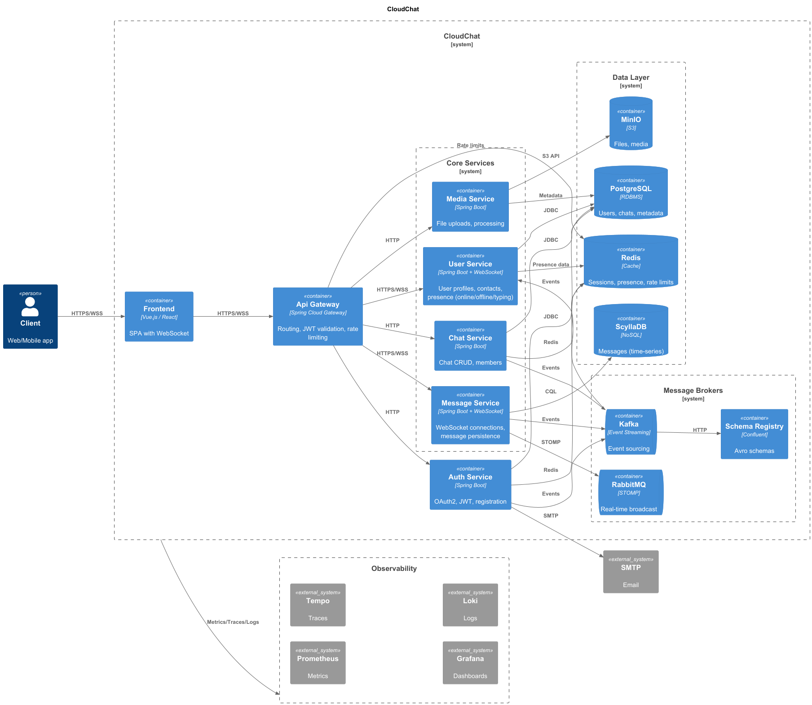

# CloudChat

[//]: # (![CloudChat Logo]&#40;docs/logo.png&#41;)

**Распределённый, безопасный и масштабируемый мессенджер на основе микросервисной архитектуры**

---

CloudChat — это открытый проект для создания приватного, масштабируемого мессенджера, где клиенты могут общаться через сеть сервисов. Система проектируется с прицелом на безопасность, отказоустойчивость и лёгкую масштабируемость.

---

## Содержание
- [Ключевые особенности](#ключевые-особенности)
- [Архитектура](#архитектура)
- [Технологический стек](#технологический-стек)
- [Быстрый старт](#быстрый-старт)
- [Локальная разработка (Docker)](#локальная-разработка-docker)
- [Дорожная карта](#дорожная-карта)
- [Контакты](#контакты)

---

## Ключевые особенности
- Микросервисная архитектура: отдельные сервисы для аутентификации, сообщений, пользователей и медиа.
- Безопасность: JWT / OAuth.
- Масштабируемость: горизонтальное масштабирование сервисов, поддержка очередей (Kafka).
- Поддержка мультимедиа: хранение в MinIO (S3-совместимое).
- Поддержка realtime: WebSocket / STOMP / gRPC для низкой задержки доставки сообщений.
- Гибкость хранения: PostgreSQL + Cassandra/ScyllaDB для долговременных данных, Redis для кэша и сессий.
- Наблюдаемость: Prometheus, Grafana, Loki и Tempo для метрик, логов и трейсов.

---

## Архитектура

Коротко об основных компонентах:
- **API Gateway** — единственная точка входа для клиентов, маршрутизация и балансировка.
- **Auth Service** — регистрация, вход, управление токенами, интеграция с внешними провайдерами.
- **User Service** — профили пользователей, настройки, контакты, presense.
- **Message Service** — маршрутизация, хранение и доставка сообщений.
- **Media Service** — загрузка/доступ к файлам, интеграция с MinIO.
- **Event Bus** — Kafka для асинхронной коммуникации между сервисами.
- **Observability** — Prometheus (метрики), Grafana (дашборды), Loki (логи), Tempo (трассировка).

---

## Технологический стек
- Язык: Java (Spring Boot, Spring Cloud)
- Базы данных: PostgreSQL, Cassandra/ScyllaDB, Redis
- Очереди: Kafka, RabbitMQ
- Объектное хранилище: MinIO (S3 compat)
- Контейнеризация: Docker
- Оркестрация: Kubernetes (в планах / helm charts)
- Observability: Prometheus, Grafana, Loki, Tempo
- Протоколы: REST, gRPC, WebSocket, STOMP

---

## Быстрый старт

Будет добавлен позже.

---

## Локальная разработка (Docker)

Будет добавлен позже.

---

## Дорожная карта
- [x] Инициализация репозитория и базовая структура, реализованы основные архитектурные диаграммы.
- [x] Реализация Auth сервиса с регистрацией, JWT аутентификацией, oauth2-auth-server.
- [x] Создание Docker образа для auth сервиса.
- [ ] Настройка Observability (Prometheus, Grafana, Loki, Tempo).
- [ ] Реализация User сервиса с профилями, контактами, presense.
- [ ] Реализация Message сервиса с отправкой/получением сообщений, хранением в БД.
- [ ] Реализация Media сервиса с загрузкой/доступ
- [ ] Написание документации по API и архитектуре.

---

## Контакты
- GitHub: https://github.com/hexaend
- Обсуждения / Issues: используйте раздел Issues в репозитории для вопросов и предложений

---
